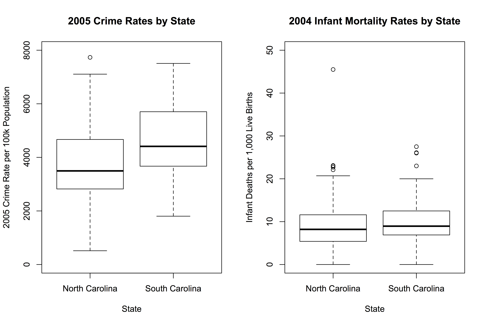
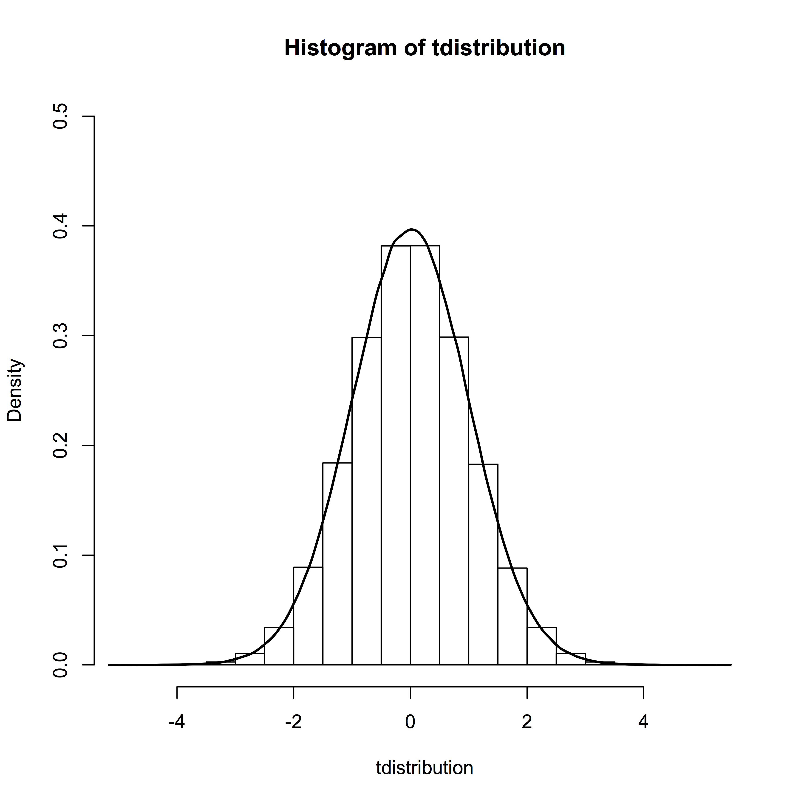
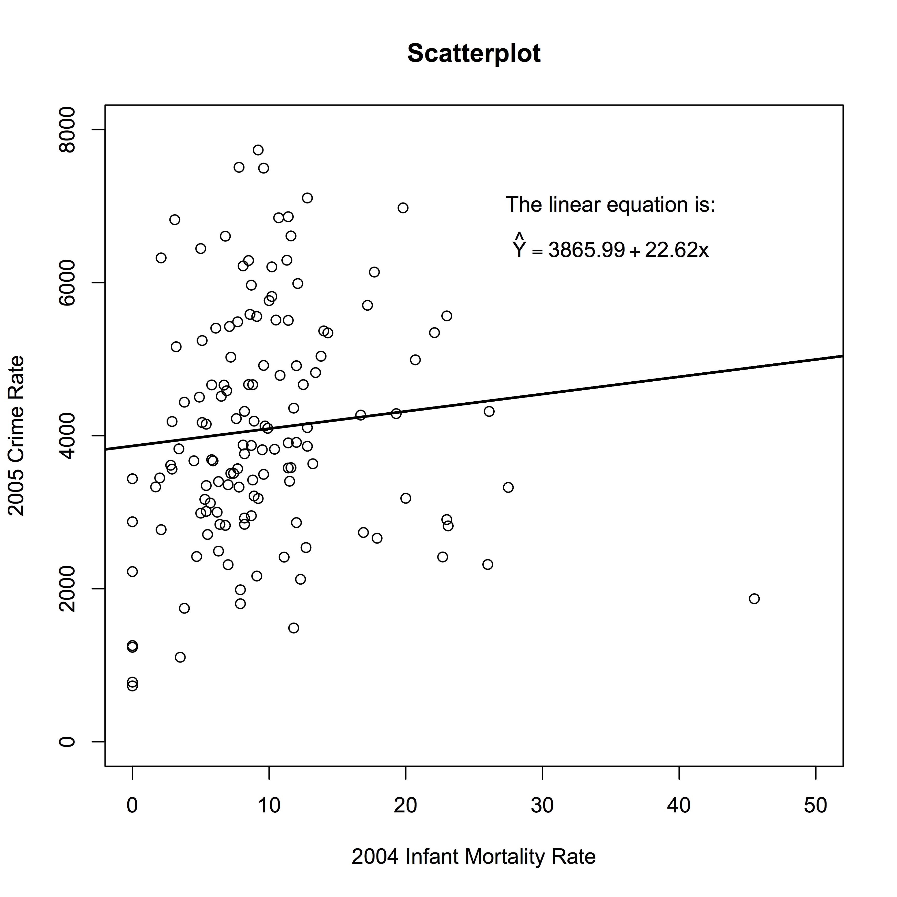
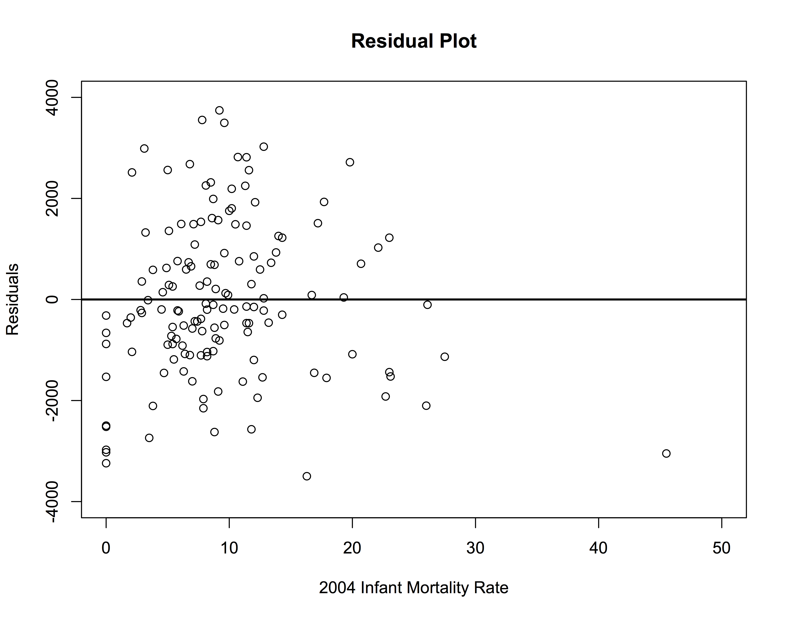
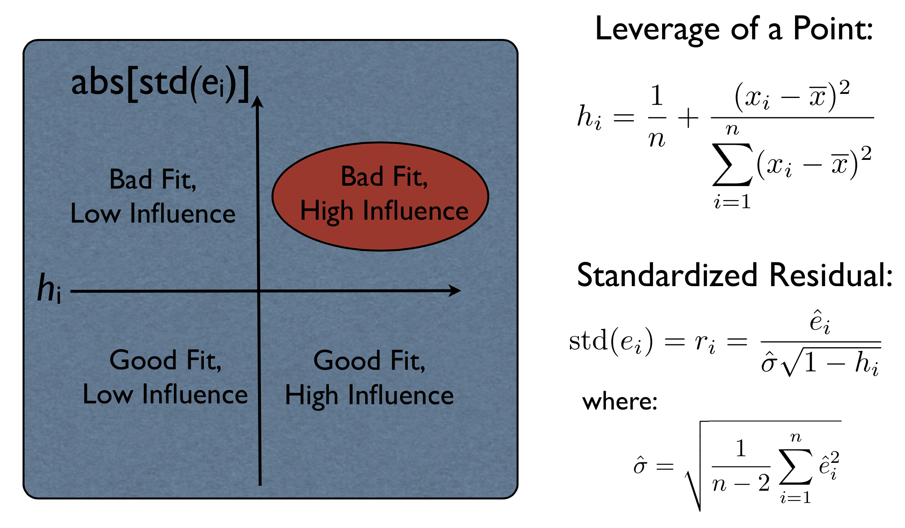

# Introduction to R Workshop

* I developed this workshop for the University of Maryland Criminology
[Statistical Applications Lecture Series](http://ccjs.umd.edu/event/sacc-lecture-analysis-r).

* There is an interesting [history](http://www.research.att.com/articles/featured_stories/2013_09/201309_SandR.html?fbid=Bi82UOKWZCB) of the development of 
the [S Language](https://web.archive.org/web/20020823122416/http://stat.bell-labs.com/S/) and how it evolved into the [R Project](http://www.r-project.org).

* Today, R is free, extensively supported, widely used in the
statistical, natural, and social sciences, and can run on Microsoft Windows,
Mac OS X, and Linux operating systems.

* R is a high-level, object-oriented programming language with many 
built-in and add-on functions and libraries to support a broad range 
of data analysis, management, and visualization tasks.

### How to Get R Up and Running ###

* Visit the [Download and Install R ](http://lib.stat.cmu.edu/R/CRAN/) website.

* There are many mirrors around the world where R can be obtained, updated,
and extended. I usually use the one at [UC Berkeley](https://cran.cnr.berkeley.edu).

### How to Read in a Data Set ###

Consider the following comma-delimited dataset:

```R
state,county,icr2005,icr2006,unemployment,urban,region,infantmort
NC,Alamance,4668.4,4807.4,2.8,2,2,8.5
NC,Alexander,2538.4,2498.7,2.3,2,2,12.7
NC,Alleghany,.,.,7.0,1,1,20.4
NC,Anson,5511.1,4921.7,6.6,1,2,10.5
NC,Ashe,1744.7,1882.4,6.2,1,1,3.8
NC,Avery,1235.0,1270.8,3.4,1,1,0.0
NC,Beaufort,3329.7,3351.4,7.6,2,3,1.7
NC,Bertie,2954.2,2592.6,9.1,1,3,8.7
NC,Bladen,4104.7,5089.9,5.8,1,3,12.8
NC,Brunswick,4661.4,4653.5,4.5,2,3,6.7
NC,Buncombe,4149.6,3715.5,2.6,2,1,5.4
NC,Burke,2987.5,2513.5,3.2,2,1,5.0
NC,Cabarrus,3420.8,3603.8,2.6,2,2,8.8
NC,Caldwell,3404.9,3467.6,2.4,2,1,11.5
NC,Camden,730.2,870.0,2.6,2,3,0.0
NC,Carteret,3179.2,3338.1,4.4,2,3,9.2
NC,Caswell,2420.8,2554.8,2.6,1,2,4.7
NC,Catawba,5243.3,4642.4,2.2,2,2,5.1
NC,Chatham,2412.8,2666.0,1.9,1,2,11.1
NC,Cherokee,2846.0,.,7.4,1,1,7.7
NC,Chowan,2708.9,2826.5,4.0,1,3,5.5
NC,Clay,1486.8,1610.0,4.1,1,1,11.8
NC,Cleveland,4360.1,3945.9,6.0,2,2,11.8
NC,Columbus,5987.8,5688.5,10.6,1,3,12.1
NC,Craven,4318.5,4175.7,4.2,2,3,8.2
NC,Cumberland,6846.9,7380.2,4.2,2,2,10.7
NC,Currituck,2875.3,2458.2,2.5,1,3,0.0
NC,Dare,5404.7,5010.1,5.1,1,3,6.1
NC,Davidson,3508.4,3545.6,2.8,2,2,7.4
NC,Davie,3508.4,3545.6,4.3,2,2,7.2
NC,Duplin,3399.5,3027.9,5.0,1,3,6.3
NC,Durham,6606.6,6640.5,2.3,3,2,6.8
NC,Edgecombe,5369.4,5856.9,7.5,2,3,14.0
NC,Forsyth,5764.6,6072.4,2.8,3,2,10.0
NC,Franklin,2313.9,2152.1,2.6,2,2,7.0
NC,Gaston,5487.7,5301.2,6.1,3,2,7.7
NC,Gates,1356.3,.,3.2,1,3,8.8
NC,Graham,.,.,8.1,1,1,11.0
NC,Granville,3877.8,3965.8,4.1,2,2,8.1
NC,Greene,2415.2,2949.5,4.4,1,3,22.7
NC,Guilford,5819.0,5754.7,2.9,3,2,10.2
NC,Halifax,5346.4,5270.5,7.5,1,3,22.1
NC,Harnett,4189.6,3928.9,3.9,2,2,8.9
NC,Haywood,3120.5,3283.0,3.9,2,1,5.7
NC,Henderson,3010.9,2921.6,2.1,2,1,5.4
NC,Hertford,4917.8,3536.7,5.5,1,3,9.6
NC,Hoke,4095.7,3997.9,8.0,2,2,9.9
NC,Hyde,514.0,.,6.5,1,3,0.0
NC,Iredell,4015.9,.,3.3,2,2,4.6
NC,Jackson,3562.9,3681.7,3.5,1,1,2.9
NC,Johnston,3327.7,3583.8,2.2,2,2,7.8
NC,Jones,3437.2,2810.9,5.2,1,3,0.0
NC,Lee,4823.9,4739.9,4.1,2,2,13.4
NC,Lenoir,6610.5,5830.8,5.5,2,3,11.6
NC,Lincoln,1104.7,3792.7,4.1,2,2,3.5
NC,Macon,2165.6,2270.4,3.5,1,1,9.1
NC,Madison,1257.5,1313.6,3.3,1,1,0.0
NC,Martin,5161.5,3466.2,9.5,1,3,3.2
NC,McDowell,2841.8,2779.4,4.6,1,1,8.2
NC,Mecklenburg,7732.8,7663.6,2.5,3,2,9.2
NC,Mitchell,.,.,5.1,1,1,6.1
NC,Montgomery,3347.7,4144.9,4.0,1,2,5.4
NC,Moore,3000.4,3045.0,3.9,2,2,6.2
NC,Nash,5507.4,6071.8,5.3,2,2,11.4
NC,New Hanover,6445.1,6157.7,3.5,3,3,5.0
NC,Northampton,3633.1,2818.7,6.5,1,3,13.2
NC,Onslow,2828.0,4067.0,3.6,2,3,6.8
NC,Orange,3913.3,4103.3,1.3,2,2,12.0
NC,Pamlico,673.1,.,3.7,1,3,16.3
NC,Pasquotank,4662.6,4336.7,3.7,1,3,5.8
NC,Pender,2492.4,2740.0,4.7,1,3,6.3
NC,Perquimans,2660.5,2567.1,3.7,1,3,17.9
NC,Person,3212.1,3531.3,4.7,1,2,8.9
NC,Pitt,5426.9,5805.7,4.7,2,3,7.1
NC,Polk,2124.3,2020.0,3.4,1,1,12.3
NC,Randolph,3827.7,3786.6,3.1,2,2,3.4
NC,Richmond,5564.9,6534.4,6.6,1,2,23.0
NC,Robeson,7106.0,6572.1,9.0,2,2,12.8
NC,Rockingham,4437.6,4717.3,5.4,2,2,3.8
NC,Rowan,3818.4,.,4.8,2,2,14.3
NC,Rutherford,3568.5,3178.4,7.6,2,1,7.7
NC,Sampson,3823.3,3481.7,4.0,1,3,10.4
NC,Scotland,4990.8,4203.1,7.4,2,2,20.7
NC,Stanly,2735.0,2997.0,4.2,2,2,16.9
NC,Stokes,2923.5,2890.6,3.2,2,2,8.2
NC,Surry,3686.1,3663.2,4.3,2,2,5.8
NC,Swain,4172.5,5337.1,12.5,1,1,5.1
NC,Transylvania,1985.6,1977.9,2.6,1,1,7.9
NC,Tyrrell,1868.7,1617.9,9.7,1,3,45.5
NC,Union,3494.9,3692.5,2.3,2,2,9.6
NC,Vance,6977.1,6996.1,8.9,2,2,19.8
NC,Wake,3359.2,3326.5,1.5,3,2,7.0
NC,Warren,3167.8,3293.7,7.8,1,3,5.3
NC,Washington,3093.5,.,6.3,1,3,0.0
NC,Watauga,2820.9,2874.5,1.5,2,1,23.1
NC,Wayne,4787.8,4712.3,4.0,2,3,10.8
NC,Wilkes,2863.8,2716.3,3.3,1,1,12.0
NC,Wilson,4269.1,4796.6,7.0,2,3,16.7
NC,Yadkin,2771.9,3080.0,3.3,2,2,2.1
NC,Yancey,780.3,804.3,3.9,1,1,0.0
SC,Abbeville,290.4,339.1,4.2,1,1,23.0
SC,Aiken,358.2,398.6,4.3,2,2,11.6
SC,Allendale,318.2,379.4,4.7,1,2,20.0
SC,Anderson,555.8,517.6,2.6,2,1,9.1
SC,Bamberg,390.6,395.6,5.1,1,2,11.4
SC,Barnwell,418.5,448.0,6.3,1,2,2.9
SC,Beaufort,451.5,448.9,2.1,2,3,6.5
SC,Berkeley,381.6,400.4,3.0,2,3,9.5
SC,Calhoun,284.1,266.6,4.7,1,2,6.4
SC,Charleston,629.3,616.6,3.0,3,3,11.3
SC,Cherokee,570.4,574.5,4.9,2,1,17.2
SC,Chester,534.3,552.5,7.4,2,2,14.3
SC,Chesterfield,357.8,372.2,5.5,1,2,11.4
SC,Clarendon,458.7,482.6,6.9,1,3,6.9
SC,Colleton,491.4,538.1,4.2,2,3,12.0
SC,Darlington,750.7,758.1,6.5,2,3,7.8
SC,Dillon,632.3,591.0,10.5,2,3,2.1
SC,Dorchester,376.3,396.8,3.0,2,3,8.2
SC,Edgefield,222.4,230.9,3.3,1,2,0.0
SC,Fairfield,431.7,456.1,7.4,1,2,26.1
SC,Florence,686.1,666.9,4.8,3,3,11.4
SC,Georgetown,386.2,424.4,7.8,2,3,12.8
SC,Greenville,502.6,490.0,2.0,3,1,7.2
SC,Greenwood,613.8,620.1,5.1,2,1,17.7
SC,Hampton,332.4,423.9,5.0,1,2,27.5
SC,Horry,749.6,722.2,3.6,3,3,9.6
SC,Jasper,682.2,648.2,3.5,1,3,3.1
SC,Kershaw,361.4,328.5,4.9,2,2,2.8
SC,Lancaster,466.6,429.8,4.1,2,2,8.8
SC,Laurens,466.7,457.0,3.4,2,1,12.5
SC,Lee,422.3,389.8,7.5,1,2,7.6
SC,Lexington,367.2,350.2,2.0,2,2,4.5
SC,McCormick,231.7,176.6,7.9,1,2,26.0
SC,Marion,621.8,594.4,15.4,1,3,8.1
SC,Marlboro,628.9,593.8,10.5,1,3,8.5
SC,Newberry,344.8,324.4,4.7,2,2,2.0
SC,Oconee,367.1,303.9,3.8,2,1,5.9
SC,Orangeburg,620.6,592.5,8.0,2,2,10.2
SC,Pickens,387.2,335.2,2.5,2,1,8.7
SC,Richland,596.7,576.3,2.8,3,2,8.7
SC,Saluda,180.4,168.0,4.3,1,2,7.9
SC,Spartanburg,503.8,539.2,3.4,3,1,13.8
SC,Sumter,558.5,570.2,4.7,2,2,8.6
SC,Union,428.8,434.0,6.6,2,1,19.3
SC,Williamsburg,412.7,374.2,12.4,1,3,9.7
SC,York,450.4,423.7,3.6,3,2,4.9
```

Note that this raw datafile has 147 rows. The first row contains
the variable names and the following 146 rows represent each county
in North and South Carolina (NC has 100 counties and SC has 46 
counties). Here is a summary dictionary:

* state (NC/SC)
* county (the spelled out name of each county)
* icr2005 (2005 index crime rate for each county)
* icr2006 (2006 index crime rate for each county)
* unemployment (2004 unemployment rate for each county)
* urban (1 = rural, 2 = mix of rural and urban, 3 = urban)
* region (1 = mountains, 2 = piedmont, 3 = coastal)
* infantmort (2004 infant mortality rate expressed in terms
of the number of infant deaths per 1000 live births)

One complication of this file is that the crime rates are 
expressed on different population scales for the counties
in the two states. Another complication is that there is some
missing data on crime rates for some of the counties. We address
both of these issues as we read in the data. To do this, let's
save the data file to our computer, call it ncsc.txt, and
read it into R's memory with the following code:

```R
ncsc <- read.csv(file="ncsc.txt",header=T,na.strings=".")
head(ncsc)
tail(ncsc)
```

and here is the output:

```
> ncsc <- read.csv(file="ncsc.txt",header=T,na.strings=".")
> head(ncsc)
  state    county icr2005 icr2006 unemployment urban region infantmort
1    NC  Alamance  4668.4  4807.4          2.8     2      2        8.5
2    NC Alexander  2538.4  2498.7          2.3     2      2       12.7
3    NC Alleghany      NA      NA          7.0     1      1       20.4
4    NC     Anson  5511.1  4921.7          6.6     1      2       10.5
5    NC      Ashe  1744.7  1882.4          6.2     1      1        3.8
6    NC     Avery  1235.0  1270.8          3.4     1      1        0.0
> tail(ncsc)
    state       county icr2005 icr2006 unemployment urban region infantmort
141    SC       Saluda   180.4   168.0          4.3     1      2        7.9
142    SC  Spartanburg   503.8   539.2          3.4     3      1       13.8
143    SC       Sumter   558.5   570.2          4.7     2      2        8.6
144    SC        Union   428.8   434.0          6.6     2      1       19.3
145    SC Williamsburg   412.7   374.2         12.4     1      3        9.7
146    SC         York   450.4   423.7          3.6     3      2        4.9
> 
```

The next problem we have to address is
the fact that the crime rates for the two
states are published differently. In NC,
the index crime rates are standardized 
per 100k population while, in SC, they are
standardized per 10k population. I also want 
to flag the counties with missing 
2005 crime rate information.

```R
ncsc2 <- ncsc
ncsc2$crime2005 <- ifelse(ncsc2$state=="SC",ncsc2$icr2005*10,ncsc2$icr2005)
ncsc2$miss2005 <- ifelse(is.na(ncsc2$icr2005),1,0)
head(ncsc2,n=5)
tail(ncsc2,n=5)
```

and here is our output:

```
> ncsc2 <- ncsc
> ncsc2$crime2005 <- ifelse(ncsc2$state=="SC",ncsc2$icr2005*10,ncsc2$icr2005)
> ncsc2$miss2005 <- ifelse(is.na(ncsc2$icr2005),1,0)
> head(ncsc2,n=5)
  state    county icr2005 icr2006 unemployment urban region infantmort
1    NC  Alamance  4668.4  4807.4          2.8     2      2        8.5
2    NC Alexander  2538.4  2498.7          2.3     2      2       12.7
3    NC Alleghany      NA      NA          7.0     1      1       20.4
4    NC     Anson  5511.1  4921.7          6.6     1      2       10.5
5    NC      Ashe  1744.7  1882.4          6.2     1      1        3.8
  crime2005 miss2005
1    4668.4        0
2    2538.4        0
3        NA        1
4    5511.1        0
5    1744.7        0
> tail(ncsc2,n=5)
    state       county icr2005 icr2006 unemployment urban region infantmort
142    SC  Spartanburg   503.8   539.2          3.4     3      1       13.8
143    SC       Sumter   558.5   570.2          4.7     2      2        8.6
144    SC        Union   428.8   434.0          6.6     2      1       19.3
145    SC Williamsburg   412.7   374.2         12.4     1      3        9.7
146    SC         York   450.4   423.7          3.6     3      2        4.9
    crime2005 miss2005
142      5038        0
143      5585        0
144      4288        0
145      4127        0
146      4504        0
> 
```

Now, 
we subset the dataframe so that only the
counties with valid 2005 crime rates are included. 
Then, we round off the crime rates to the nearest whole number
so the two states' crime rates are reported at the same 
precision. Finally, we write the ncsc3 dataframe to 
an external R dataset.

```R
ncsc3 <- subset(ncsc2,miss2005==0)
ncsc3$crime2005 <- round(ncsc3$crime2005,digits=0)
head(ncsc3)
tail(ncsc3)
save(ncsc3,file="ncsc3.rdata")
```

and here is the output:

```
> ncsc3 <- subset(ncsc2,miss2005==0)
> ncsc3$crime2005 <- round(ncsc3$crime2005,digits=0)
> head(ncsc3)
  state    county icr2005 icr2006 unemployment urban region infantmort
1    NC  Alamance  4668.4  4807.4          2.8     2      2        8.5
2    NC Alexander  2538.4  2498.7          2.3     2      2       12.7
4    NC     Anson  5511.1  4921.7          6.6     1      2       10.5
5    NC      Ashe  1744.7  1882.4          6.2     1      1        3.8
6    NC     Avery  1235.0  1270.8          3.4     1      1        0.0
7    NC  Beaufort  3329.7  3351.4          7.6     2      3        1.7
  crime2005 miss2005
1      4668        0
2      2538        0
4      5511        0
5      1745        0
6      1235        0
7      3330        0
> tail(ncsc3)
    state       county icr2005 icr2006 unemployment urban region infantmort
141    SC       Saluda   180.4   168.0          4.3     1      2        7.9
142    SC  Spartanburg   503.8   539.2          3.4     3      1       13.8
143    SC       Sumter   558.5   570.2          4.7     2      2        8.6
144    SC        Union   428.8   434.0          6.6     2      1       19.3
145    SC Williamsburg   412.7   374.2         12.4     1      3        9.7
146    SC         York   450.4   423.7          3.6     3      2        4.9
    crime2005 miss2005
141      1804        0
142      5038        0
143      5585        0
144      4288        0
145      4127        0
146      4504        0
> save(ncsc3,file="ncsc3.rdata")
> 
```

When this process has completed, you should see the new
R dataframe in your working directory.

Now, let's exit R and then restart. Once you are back
in the R command window, let's use the ncsc3.rdata
dataset to create a pair of boxplots comparing the 2005 
crime rates and the 2004 infant mortality rates between the 
two states:

```R
load(file="ncsc3.rdata")

nrow(ncsc3)

library(psych)
describe(ncsc3)

par(mfrow=c(1,2))

boxplot(ncsc3$crime2005~ncsc3$state,
  main="2005 Crime Rates by State",
  xlab="State",
  ylab="2005 Crime Rate per 100k Population",
  ylim=c(0,8000),
  names=c("North Carolina","South Carolina"))

boxplot(ncsc3$infantmort~ncsc3$state,
  main="2004 Infant Mortality Rates by State",
  xlab="State",
  ylab="Infant Deaths per 1,000 Live Births",
  ylim=c(0,50),
  names=c("North Carolina","South Carolina"))
```

Here is the plot created by our R code:



and the output that appears in the R command window:

```
> load(file="ncsc3.rdata")
> 
> nrow(ncsc3)
[1] 143
> 
> library(psych)
> describe(ncsc3)
             vars   n    mean      sd median trimmed     mad   min    max
state*          1 143    1.32    0.47    1.0    1.28    0.00   1.0    2.0
county*         2 143   71.68   41.30   72.0   71.64   53.37   1.0  142.0
icr2005         3 143 2659.38 1984.67 2828.0 2503.76 3035.92 180.4 7732.8
icr2006         4 136 2683.82 1999.43 2814.8 2524.67 2946.22 168.0 7663.6
unemployment    5 143    4.84    2.41    4.2    4.54    1.78   1.3   15.4
urban           6 143    1.69    0.64    2.0    1.61    1.48   1.0    3.0
region          7 143    2.14    0.74    2.0    2.17    1.48   1.0    3.0
infantmort      8 143    9.53    6.48    8.6    8.83    4.60   0.0   45.5
crime2005       9 143 3998.36 1558.47 3823.0 3975.51 1454.43 514.0 7733.0
miss2005       10 143    0.00    0.00    0.0    0.00    0.00   0.0    0.0
              range  skew kurtosis     se
state*          1.0  0.76    -1.44   0.04
county*       141.0  0.01    -1.25   3.45
icr2005      7552.4  0.39    -0.89 165.97
icr2006      7495.6  0.38    -0.88 171.45
unemployment   14.1  1.41     2.50   0.20
urban           2.0  0.39    -0.74   0.05
region          2.0 -0.22    -1.15   0.06
infantmort     45.5  1.74     5.99   0.54
crime2005    7219.0  0.17    -0.35 130.33
miss2005        0.0   NaN      NaN   0.00
> 
> par(mfrow=c(1,2))
> 
> boxplot(ncsc3$crime2005~ncsc3$state,
+   main="2005 Crime Rates by State",
+   xlab="State",
+   ylab="2005 Crime Rate per 100k Population",
+   ylim=c(0,8000),
+   names=c("North Carolina","South Carolina"))
> 
> boxplot(ncsc3$infantmort~ncsc3$state,
+   main="2004 Infant Mortality Rates by State",
+   xlab="State",
+   ylab="Infant Deaths per 1,000 Live Births",
+   ylim=c(0,50),
+   names=c("North Carolina","South Carolina"))
> 
```

### Basic Ideas for Linear Regression ###

Consider the problem of *x* and *y* that are probabilistically
and linearly related:

<p align="center">

</p>

This equation implies that there is error in the relationship 
between *x* and *y*. We introduce the error into the linear 
equation as follows:

<p align="center">

</p>

and, we make 
the following statements about *e*: 

* the error term, *e*, is normally distributed with constant variance
* no covariance between *e* for two observations
* no covariance between *e* and *x*

To estimate the slope coefficient, we use the following estimator:

<p align="center">

</p>

Next, we estimate the y-intercept. The formula is:

<p align="center">

</p>

To implement these estimators in R, we load the dataframe 
(N = 143 counties), let the 2004 infant mortality rate be 
the independent variable, *x*, and let the 2005 crime rate 
be the outcome variable, *y*.

```R
load(file="ncsc3.Rdata")
sxypt1.i <- (ncsc3$infantmort-mean(ncsc3$infantmort))
sxypt2.i <- (ncsc3$crime2005-mean(ncsc3$crime2005))
sxy <- sum(sxypt1.i*sxypt2.i)
sxx <- sum((ncsc3$infantmort-mean(ncsc3$infantmort))^2)
beta1 <- sxy/sxx
beta0 <- mean(ncsc3$crime2005)-beta1*mean(ncsc3$infantmort)
beta1
beta0
```

and here is the output:

```
> load(file="ncsc3.Rdata")
> sxypt1.i <- (ncsc3$infantmort-mean(ncsc3$infantmort))
> sxypt2.i <- (ncsc3$crime2005-mean(ncsc3$crime2005))
> sxy <- sum(sxypt1.i*sxypt2.i)
> sxx <- sum((ncsc3$infantmort-mean(ncsc3$infantmort))^2)
> beta1 <- sxy/sxx
> beta0 <- mean(ncsc3$crime2005)-beta1*mean(ncsc3$infantmort)
> beta1
[1] 25.54544
> beta0
[1] 3754.807
```

Now, we estimate the variance of the error term (i.e., the
mean square error of the regression). The estimator for this 
variance is:

<p align="center">

</p>

and the R code is:

```R
ncases <- nrow(ncsc3)
ncases
yhat <- beta0+beta1*ncsc3$infantmort
errorterm <- ncsc3$crime2005-yhat
rss <- sum(errorterm^2)
mse <- (1/(ncases-2))*rss
rss
mse
```

and the output is:

```
> ncases <- nrow(ncsc3)
> ncases
[1] 143
> yhat <- beta0+beta1*ncsc3$infantmort
> errorterm <- ncsc3$crime2005-yhat
> rss <- sum(errorterm^2)
> mse <- (1/(ncases-2))*rss
> rss
[1] 341007033
> mse
[1] 2418490
> 
```

An estimate of the variance of the error term 
is needed to calculate t-tests and confidence 
intervals for the regression coefficients, the 
regression line, and the predicted values of 
the outcome variable. Thus far, we have the 
following estimates for the slope, y-intercept, 
and the variance of the error term:

```R
parmestimates <- data.frame(beta0,beta1,mse)
parmestimates
```

and the output is:

```
> parmestimates <- data.frame(beta0,beta1,mse)
> parmestimates
     beta0    beta1     mse
1 3754.807 25.54544 2418490
> 
```

Next, we estimate the standard errors of the slope
and y-intercept estimates. First, the standard error
of the slope coefficient is:

<p align="center">

</p>

while the standard error of the y-intercept is:

<p align="center">

</p>

The R code for these two calculations is:

```R
rootmse <- sqrt(mse)
sebeta1 <- rootmse/sqrt(sxx)
sebeta0pt1 <- 1/ncases
sebeta0pt2 <- (mean(ncsc3$infantmort)^2)/sxx
sebeta0 <- rootmse*sqrt(sebeta0pt1+sebeta0pt2)
rootmse
standarderrors <- data.frame(sebeta0,sebeta1)
standarderrors
```

and the output is:

```
> rootmse <- sqrt(mse)
> sebeta1 <- rootmse/sqrt(sxx)
> sebeta0pt1 <- 1/ncases
> sebeta0pt2 <- (mean(ncsc3$infantmort)^2)/sxx
> sebeta0 <- rootmse*sqrt(sebeta0pt1+sebeta0pt2)
> rootmse
[1] 1555.149
> standarderrors <- data.frame(sebeta0,sebeta1)
> standarderrors
  sebeta0  sebeta1
1 232.025 20.15402
> 
```

Finally, we calculate *t*-ratios to test the hypotheses
that slope and intercept are equal to zero. The *t*-ratio for
the slope is:

<p align="center">

</p>

and the *t*-ratio for the y-intercept is:

<p align="center">

</p>

and each *t*-statistic follows a theoretical *t*-distribution
with *N-2* degrees of freedom. To test the null hypothesis 
that the intercept is zero, we need to identify the critical region of 
the *t*-distribution. If the *t*-statistic we obtain falls 
within the critical region, we reject the null hypothesis. 
Otherwise, we fail to reject the null hypothesis. We define 
the critical region before we look at the data. 

For this analysis, we will define the critical region 
(*p* < .05) in the two tails of the *t*-distribution 
(i.e., we take the two .025 extremes of the distribution). 
Let's actually generate a *t*-distribution using R's random 
number generator and identify the .025/.975 quantiles of the
distribution. Here is the R code:

```R
tdistribution <- rt(1000000,ncases-2)
hist(tdistribution,prob=T,ylim=c(0,0.5))
lines(density(tdistribution),lty=1,lwd=2)
quantile(tdistribution,0.025)
quantile(tdistribution,0.975)
lowerlimit <- qt(0.025,ncases-2)
upperlimit <- qt(0.975,ncases-2)
tlimits <- data.frame(lowerlimit,upperlimit)
tlimits
```

This code gives us the following results (including a histogram
of a simulated *t*-distribution with 141 degrees of freedom):

```
> tdistribution <- rt(1000000,ncases-2)
> hist(tdistribution,prob=T,ylim=c(0,0.5))
> lines(density(tdistribution),lty=1,lwd=2)
> quantile(tdistribution,0.025)
     2.5% 
-1.980421 
> quantile(tdistribution,0.975)
   97.5% 
1.976545 
> lowerlimit <- qt(0.025,ncases-2)
> upperlimit <- qt(0.975,ncases-2)
> tlimits <- data.frame(lowerlimit,upperlimit)
> tlimits
  lowerlimit upperlimit
1  -1.976931   1.976931
> 
```



Now, we calculate the *t*-ratios for our y-intercept and
regression coefficient:

```R
tratio_beta1 <- beta1/sebeta1
tratio_beta0 <- beta0/sebeta0
tratio_beta1
tratio_beta0
```

which gives us the following output:

```
> tratio_beta1 <- beta1/sebeta1
> tratio_beta0 <- beta0/sebeta0
> tratio_beta1
[1] 1.267511
> tratio_beta0
[1] 16.18277
> 
```

Comparing these *t*-ratios to the critical region of 
the *t*-distribution, we conclude that the null hypothesis 
should be rejected for the intercept and the null hypothesis 
should not be rejected for the slope.

### Matrix Solution ###

Of course, a linear regression model can be estimated using
matrix algebra. The coefficient vector is given by:

<p align="center">

</p>

Then, the hat matrix is:

<p align="center">

</p>

The residual vector, **e** is:

<p align="center">

</p>

The error sum of squares is:

<p align="center">

</p>

while the total sum of squares is:

<p align="center">

</p>

and the proportion of variance explained is:

<p align="center">

</p>

The mean square error (MSE) is:

<p align="center">

</p>

Now, we can calculate the variance-covariance matrix of
the parameter estimates as:

<p align="center">

</p>

and the vector of standard errors is:

<p align="center">

</p>

Next, we code these operations in R to obtain the least 
squares solution to our problem:

```R
ones <- rep(1,ncases)
x <- matrix(cbind(ones,ncsc3$infantmort),nrow=ncases,ncol=2)
y <- ncsc3$crime2005
xtxinv <- solve(a=t(x)%*%x)
xty <- t(x)%*%y
slopevec <- xtxinv%*%xty
slopevec
h <- x%*%xtxinv%*%t(x) 
e <- y-h%*%y
sse <- (t(e)%*%e)
sst <- sum((y-mean(y))^2)
rsq <- 1-(sse/sst)
rsq
mse <- sse/(nrow(ncsc3)-2)
mse <- as.vector(mse)
mse
rmse <- sqrt(mse)
rmse
vb <- mse*xtxinv
sevec <- sqrt(diag(vb))
sevec
```

Here is the output:

```
> ones <- rep(1,ncases)
> x <- matrix(cbind(ones,ncsc3$infantmort),nrow=ncases,ncol=2)
> y <- ncsc3$crime2005
> xtxinv <- solve(a=t(x)%*%x)
> xty <- t(x)%*%y
> slopevec <- xtxinv%*%xty
> slopevec
           [,1]
[1,] 3754.80658
[2,]   25.54544
> h <- x%*%xtxinv%*%t(x)
> e <- y-h%*%y
> sse <- (t(e)%*%e)
> sst <- sum((y-mean(y))^2)
> rsq <- 1-(sse/sst)
> rsq
           [,1]
[1,] 0.01126585
> mse <- sse/(nrow(ncsc3)-2)
> mse <- as.vector(mse)
> mse
[1] 2418490
> rmse <- sqrt(mse)
> rmse
[1] 1555.149
> vb <- mse*xtxinv
> sevec <- sqrt(diag(vb))
> sevec
[1] 232.02502  20.15402
> 
```

### R's ```lm()``` Regression Function ###

Using the R code below, we estimate a
linear regression model using the ```lm()``` function. 
We then ```summarize()``` the results.

```R
load("ncsc3.rdata")
regmodel <- lm(ncsc3$crime2005~ncsc3$infantmort)
summary(regmodel)
```

which gives us the following output:

```
> regmodel <- lm(ncsc3$crime2005~ncsc3$infantmort)
> summary(regmodel)

Call:
lm(formula = ncsc3$crime2005 ~ ncsc3$infantmort)

Residuals:
    Min      1Q  Median      3Q     Max 
-3498.2 -1038.4  -197.5   978.7  3743.2 

Coefficients:
                 Estimate Std. Error t value Pr(>|t|)    
(Intercept)       3754.81     232.03  16.183   <2e-16 ***
ncsc3$infantmort    25.55      20.15   1.268    0.207    
---
Signif. codes:  0 ‘***’ 0.001 ‘**’ 0.01 ‘*’ 0.05 ‘.’ 0.1 ‘ ’ 1

Residual standard error: 1555 on 141 degrees of freedom
Multiple R-squared:  0.01127,	Adjusted R-squared:  0.004254 
F-statistic: 1.607 on 1 and 141 DF,  p-value: 0.2071

> 
```

Now, let's calculate a 95% confidence interval around
the regression line. We begin by allowing *x* to vary
across its range and for each value of *x*, we calculate: 

<p align="center">

</p>

Then, we calculate the sum of squares for the *x*
variable in the original dataset:

<p align="center">

</p>

Next, we estimate the standard error of the regression
line by:

<p align="center">

</p>

Then, we identify the absolute value of t* that gives
us the 0.025 and 0.975 percentiles of the cumulative
*t* distribution with *N-2* degrees of freedom. The 95%
confidence interval of the regression line is:

<p align="center">

</p>

```R
ncases <- nrow(ncsc3)
ssx <- sum((ncsc3$infantmort-mean(ncsc3$infantmort)^2))
varx <- var(ncsc3$infantmort)

min(ncsc3$infantmort)
max(ncsc3$infantmort)

x <- seq(from=0,to=50,by=0.1)

beta0 <- coef(regmodel)[1]
beta1 <- coef(regmodel)[2]
yhat <- beta0+beta1*x

rmse <- summary(regmodel)$sigma

sey_pt1 <- 1/ncases
sey_pt2 <- (x-mean(ncsc3$infantmort))^2
sey_pt3 <- (ncases-1)*varx
sey <- rmse*sqrt(sey_pt1+(sey_pt2/sey_pt3))

crit_t <- qt(0.975,ncases-2)
crit_t 

lower_cl <- yhat-crit_t*sey
upper_cl <- yhat+crit_t*sey
```

Here is the output:

```
> ncases <- nrow(ncsc3)
> ssx <- sum((ncsc3$infantmort-mean(ncsc3$infantmort)^2))
> varx <- var(ncsc3$infantmort)
> 
> min(ncsc3$infantmort)
[1] 0
> max(ncsc3$infantmort)
[1] 45.5
> 
> x <- seq(from=0,to=50,by=0.1)
> 
> beta0 <- coef(regmodel)[1]
> beta1 <- coef(regmodel)[2]
> yhat <- beta0+beta1*x
> 
> rmse <- summary(regmodel)$sigma
> 
> sey_pt1 <- 1/ncases
> sey_pt2 <- (x-mean(ncsc3$infantmort))^2
> sey_pt3 <- (ncases-1)*varx
> sey <- rmse*sqrt(sey_pt1+(sey_pt2/sey_pt3))
> 
> crit_t <- qt(0.975,ncases-2)
> crit_t
[1] 1.976931
> lower_cl <- yhat-crit_t*sey
> upper_cl <- yhat+crit_t*sey
> 
```

Finally, we generate a scatterplot:

```R
plot(x=ncsc3$infantmort,
     y=ncsc3$crime2005,
     xlim=c(0,50),
     ylim=c(0,8000),
     main="Scatterplot",
     xlab="2004 Infant Mortality Rate",
     ylab="2005 Crime Rate")
abline(a=beta0,b=beta1,lty=1,lwd=2)
text(x=35,y=7000,"The linear equation is:")
text(x=35,y=6500,expression(hat(Y) == 3754.81 + 25.55*x))
lines(x=x,y=lower_cl,lty=1,lwd=2,col="red")
lines(x=x,y=upper_cl,lty=1,lwd=2,col="red")
```

and the resulting chart looks like this:



We can also create a residual plot:

```R
residuals1 <- ncsc3$crime2005-(beta0+beta1*ncsc3$infantmort)
residuals2 <- residuals(regmodel)
data.frame(residuals1,residuals2)

plot(x=ncsc3$infantmort,
     y=residuals1,
     xlim=c(0,50),
     ylim=c(-4000,4000),
     main="Residual Plot",
     xlab="2004 Infant Mortality Rate",
     ylab="Residuals")
abline(h=0,lty=1,lwd=2)
```

The output looks like this:

```
> residuals1 <- ncsc3$crime2005-(beta0+beta1*ncsc3$infantmort)
> residuals2 <- residuals(regmodel)
> data.frame(residuals1,residuals2)
     residuals1  residuals2
1     696.05714   696.05714
2   -1541.23373 -1541.23373
3    1487.96625  1487.96625
4   -2106.87927 -2106.87927
5   -2519.80658 -2519.80658
6    -468.23383  -468.23383
7   -1023.05195 -1023.05195
8      23.21173    23.21173
9     735.03894   735.03894
10    257.24802   257.24802
11   -894.53380  -894.53380
12   -558.60649  -558.60649
13   -643.57919  -643.57919
14  -3024.80658 -3024.80658
15   -810.82467  -810.82467
16  -1453.87017 -1453.87017
17   1357.91165  1357.91165
18  -1625.36101 -1625.36101
19  -1105.50650 -1105.50650
20  -1186.30652 -1186.30652
21  -2569.24283 -2569.24283
22    303.75717   303.75717
23   1924.09354  1924.09354
24    353.72078   353.72078
25   2818.85716  2818.85716
26   -879.80658  -879.80658
27   1494.36621  1494.36621
28   -435.84287  -435.84287
29   -430.73378  -430.73378
30   -515.74288  -515.74288
31   2678.48440  2678.48440
32   1256.55720  1256.55720
33   1754.73897  1754.73897
34  -1619.62469 -1619.62469
35   1536.49350  1536.49350
36  -2623.60649 -2623.60649
37    -83.72468   -83.72468
38  -1919.68817 -1919.68817
39   1803.62989  1803.62989
40   1026.63909  1026.63909
41    207.83896   207.83896
42   -780.41561  -780.41561
43   -881.75198  -881.75198
44    917.95715   917.95715
45     88.29352    88.29352
46  -3240.80658 -3240.80658
47    143.68438   143.68438
48   -265.88837  -265.88837
49   -626.06105  -626.06105
50   -317.80658  -317.80658
51    726.88446   726.88446
52   2558.86626  2558.86626
53  -2739.21564 -2739.21564
54  -1821.27013 -1821.27013
55  -2496.80658 -2496.80658
56   1325.44800  1325.44800
57  -1122.27922 -1122.27922
58   3743.17533  3743.17533
59   -544.75198  -544.75198
60   -913.18834  -913.18834
61   1460.97535  1460.97535
62   2562.46620  2562.46620
63   -459.00645  -459.00645
64  -1100.51560 -1100.51560
65   -148.35191  -148.35191
66  -3498.19733 -3498.19733
67    760.02984   760.02984
68  -1423.74288 -1423.74288
69  -1552.07004 -1552.07004
70   -770.16104  -770.16104
71   1490.82076  1490.82076
72  -1945.01555 -1945.01555
73    -13.66109   -13.66109
74   1222.64819  1222.64819
75   3024.21173  3024.21173
76    586.12073   586.12073
77   -302.10644  -302.10644
78   -383.50650  -383.50650
79   -197.47920  -197.47920
80    707.40272   707.40272
81  -1451.52459 -1451.52459
82  -1040.27922 -1040.27922
83   -216.97016  -216.97016
84    286.91165   286.91165
85  -1970.61559 -1970.61559
86  -3048.12431 -3048.12431
87   -505.04285  -505.04285
88   2716.39362  2716.39362
89   -574.62469  -574.62469
90   -722.19744  -722.19744
91   -660.80658  -660.80658
92  -1523.90635 -1523.90635
93    757.30262   757.30262
94  -1197.35191 -1197.35191
95     87.58450    87.58450
96  -1036.45201 -1036.45201
97  -2974.80658 -2974.80658
98  -1438.35181 -1438.35181
99   -469.13374  -469.13374
100 -1083.71547 -1083.71547
101  1570.72987  1570.72987
102  -140.02465  -140.02465
103   356.11163   356.11163
104   594.14803   594.14803
105  -181.48830  -181.48830
106 -1077.29742 -1077.29742
107  2249.52990  2249.52990
108  1509.81177  1509.81177
109  1222.89356  1222.89356
110  -468.02465  -468.02465
111   655.92985   655.92985
112   852.64809   852.64809
113  3552.93895  3552.93895
114  2514.54799  2514.54799
115  -201.27922  -201.27922
116 -1530.80658 -1530.80658
117  -104.54268  -104.54268
118  2814.97535  2814.97535
119  -219.78827  -219.78827
120  1087.26622  1087.26622
121  1931.03905  1931.03905
122 -1133.30631 -1133.30631
123  3495.95715  3495.95715
124  2988.00254  2988.00254
125  -212.33382  -212.33382
126   686.39351   686.39351
127   592.87536   592.87536
128   274.04804   274.04804
129  -197.76108  -197.76108
130 -2101.98814 -2101.98814
131  2256.27532  2256.27532
132  2317.05714  2317.05714
133  -357.89747  -357.89747
134  -234.52470  -234.52470
135  2190.62989  2190.62989
136  -105.05195  -105.05195
137  1989.94805  1989.94805
138 -2152.61559 -2152.61559
139   930.66629   930.66629
140  1610.50260  1610.50260
141    40.16634    40.16634
142   124.40261   124.40261
143   624.02074   624.02074
> 
> plot(x=ncsc3$infantmort,
+      y=residuals1,
+      xlim=c(0,50),
+      ylim=c(-4000,4000),
+      main="Residual Plot",
+      xlab="2004 Infant Mortality Rate",
+      ylab="Residuals")
> abline(h=0,lty=1,lwd=2)
> 
```

And, the basic residual plot looks like this:



In both the scatterplot and the residual plot, there is an observation
that looks like it could be an outlying case. The question is whether
it is an *influential* outlying case. John Fox's [regression textbook](http://socserv.socsci.mcmaster.ca/jfox/Books/Applied-Regression-2E/index.html) and
its [companion for R](http://socserv.socsci.mcmaster.ca/jfox/Books/Companion/index.html) describe a useful approach for objectively identifying observations
that are outliers and then distinguishing between influential and 
non-influential cases of these extreme observations. The problem can be
summarized as follows: 



To implement this approach, we first look at the plotspace 
interactively by entering the following command:

```R
idx <- identify(ncsc3$infantmort,residuals1)
```

The R command prompt will disappear. When that happens, use the mouse
to left-click on a data point. At that point, you should see that case's
row number (in the dataset) appear on the plot. Once that happens, you 
can right-click (or ctrl-click on Mac OS X) on the plotspace to 
restore the R command prompt. Here is what the updated plot looks like:

<p align="center">

</p>

Now, with the number 86 next to an outlying and potentially influential 
case, we can extract that row number from the dataframe by:

```R
ncsc3[86,]
```

which gives us this output:

```
> ncsc3[86,]
   state  county icr2005 icr2006 unemployment urban region infantmort
89    NC Tyrrell  1868.7  1617.9          9.7     1      3       45.5
   crime2005 miss2005
89      1869        0
```

When we check this information against the raw data for Tyrrell County 
North Carolina (map from [Wikipedia](http://en.wikipedia.org/wiki/Tyrrell_County,_North_Carolina#/media/File:Map_of_North_Carolina_highlighting_Tyrrell_County.svg)), we get the following report:

<p align="center">

</p>

From this, we can see that Tyrrell County's infant mortality rate 
was highly sensitive to very small changes in the number of infant
deaths during this era. Using the formulas above, we now calculate
the leverage, standardized residual, and a new statistic called
the Cook's *d*:

<p align="center">

</p>

```R
# calculate influence statistics

hpt1 <- 1/nrow(ncsc3)
hpt2 <- (ncsc3$infantmort-mean(ncsc3$infantmort))^2
hpt3 <- sum((ncsc3$infantmort-mean(ncsc3$infantmort))^2)
h <- hpt1+(hpt2/hpt3)
hcutofflower <- 2*mean(h)
hcutoffhigher <- 3*mean(h)
mean(h)
hcutofflower
hcutoffhigher
subset(cbind(ncsc3,h),h>hcutofflower)
subset(cbind(ncsc3,h),h>hcutoffhigher)

# calculate standardized residuals

residual.i <- ncsc3$crime2005-predict(regmodel)
residualsq.i <- residual.i^2
rootmsept1 <- 1/(nrow(ncsc3)-2)
rootmsept2 <- sum(residualsq.i)
rootmse <- sqrt(rootmsept1*rootmsept2)
stdresid <- residual.i/(rootmse*sqrt(1-h))
subset(cbind(ncsc3,stdresid),abs(stdresid)>2)

# calculate cook's d statistic

cooksdpt1 <- (stdresid^2)/2
cooksdpt2 <- h/(1-h)
cooksd <- cooksdpt1*cooksdpt2

# create a bubble plot

plot(x=h,y=stdresid,cex=10*sqrt(cooksd))
abline(h=-2)
abline(h=2)
abline(v=2*mean(h))
abline(v=3*mean(h))
text(x=0.07,y=2.2,expression(+2*sigma))
text(x=0.07,y=-2.2,expression(-2*sigma))
text(x=0.033,y=1.0,expression(2*bar(h)))
text(x=0.048,y=0.8,expression(3*bar(h)))

# now, let's id the influential observation:

idx <- identify(h,stdresid)
```

Here is the output:

```
> hpt1 <- 1/nrow(ncsc3)
> hpt2 <- (ncsc3$infantmort-mean(ncsc3$infantmort))^2
> hpt3 <- sum((ncsc3$infantmort-mean(ncsc3$infantmort))^2)
> h <- hpt1+(hpt2/hpt3)
> hcutofflower <- 2*mean(h)
> hcutoffhigher <- 3*mean(h)
> mean(h)
[1] 0.01398601
> hcutofflower
[1] 0.02797203
> hcutoffhigher
[1] 0.04195804
> subset(cbind(ncsc3,h),h>hcutofflower)
    state    county icr2005 icr2006 unemployment urban region infantmort
40     NC    Greene  2415.2  2949.5          4.4     1      3       22.7
42     NC   Halifax  5346.4  5270.5          7.5     1      3       22.1
77     NC  Richmond  5564.9  6534.4          6.6     1      2       23.0
89     NC   Tyrrell  1868.7  1617.9          9.7     1      3       45.5
95     NC   Watauga  2820.9  2874.5          1.5     2      1       23.1
101    SC Abbeville   290.4   339.1          4.2     1      1       23.0
120    SC Fairfield   431.7   456.1          7.4     1      2       26.1
125    SC   Hampton   332.4   423.9          5.0     1      2       27.5
133    SC McCormick   231.7   176.6          7.9     1      2       26.0
    crime2005 miss2005          h
40       2415        0 0.03610484
42       5346        0 0.03351188
77       5565        0 0.03744666
89       1869        0 0.22424172
95       2821        0 0.03790065
101      2904        0 0.03744666
120      4317        0 0.05308237
125      3324        0 0.06120174
133      2317        0 0.05252761
> subset(cbind(ncsc3,h),h>hcutoffhigher)
    state    county icr2005 icr2006 unemployment urban region infantmort
89     NC   Tyrrell  1868.7  1617.9          9.7     1      3       45.5
120    SC Fairfield   431.7   456.1          7.4     1      2       26.1
125    SC   Hampton   332.4   423.9          5.0     1      2       27.5
133    SC McCormick   231.7   176.6          7.9     1      2       26.0
    crime2005 miss2005          h
89       1869        0 0.22424172
120      4317        0 0.05308237
125      3324        0 0.06120174
133      2317        0 0.05252761
> 
> # calculate standardized residuals
> 
> residual.i <- ncsc3$crime2005-predict(regmodel)
> residualsq.i <- residual.i^2
> rootmsept1 <- 1/(nrow(ncsc3)-2)
> rootmsept2 <- sum(residualsq.i)
> rootmse <- sqrt(rootmsept1*rootmsept2)
> stdresid <- residual.i/(rootmse*sqrt(1-h))
> subset(cbind(ncsc3,stdresid),abs(stdresid)>2)
    state      county icr2005 icr2006 unemployment urban region infantmort
48     NC        Hyde   514.0      NA          6.5     1      3        0.0
60     NC Mecklenburg  7732.8  7663.6          2.5     3      2        9.2
69     NC     Pamlico   673.1      NA          3.7     1      3       16.3
89     NC     Tyrrell  1868.7  1617.9          9.7     1      3       45.5
116    SC  Darlington   750.7   758.1          6.5     2      3        7.8
126    SC       Horry   749.6   722.2          3.6     3      3        9.6
    crime2005 miss2005  stdresid
48        514        0 -2.107508
60       7733        0  2.415439
69        673        0 -2.266124
89       1869        0 -2.225345
116      7507        0  2.293242
126      7496        0  2.255890
> 
> # calculate cook's d statistic
> 
> cooksdpt1 <- (stdresid^2)/2
> cooksdpt2 <- h/(1-h)
> cooksd <- cooksdpt1*cooksdpt2
> 
> plot(x=h,y=stdresid,cex=10*sqrt(cooksd))
> abline(h=-2)
> abline(h=2)
> abline(v=2*mean(h))
> abline(v=3*mean(h))
> text(x=0.07,y=2.2,expression(+2*sigma))
> text(x=0.07,y=-2.2,expression(-2*sigma))
> text(x=0.033,y=1.0,expression(2*bar(h)))
> text(x=0.048,y=0.8,expression(3*bar(h)))
> 
> idx <- identify(h,stdresid)
>
```

The resulting plot looks like this:

<p align="center">

</p>

Now, as a final step, let's exclude Tyrrell County and run the
new regression:

```R
ncsc4 <- subset(ncsc3,county!="Tyrrell")
nrow(ncsc4)
regmodel2 <- lm(ncsc4$crime2005~ncsc4$infantmort)
summary(regmodel2)
```

Here is the output:

```
> ncsc4 <- subset(ncsc3,county!="Tyrrell")
> nrow(ncsc4)
[1] 142
> regmodel2 <- lm(ncsc4$crime2005~ncsc4$infantmort)
> summary(regmodel2)

Call:
lm(formula = ncsc4$crime2005 ~ ncsc4$infantmort)

Residuals:
    Min      1Q  Median      3Q     Max 
-3686.3  -994.7  -165.8   862.0  3723.6 

Coefficients:
                 Estimate Std. Error t value Pr(>|t|)    
(Intercept)       3556.00     245.10  14.509   <2e-16 ***
ncsc4$infantmort    49.28      22.48   2.192     0.03 *  
---
Signif. codes:  0 ‘***’ 0.001 ‘**’ 0.01 ‘*’ 0.05 ‘.’ 0.1 ‘ ’ 1

Residual standard error: 1533 on 140 degrees of freedom
Multiple R-squared:  0.03319,	Adjusted R-squared:  0.02629 
F-statistic: 4.806 on 1 and 140 DF,  p-value: 0.03001

> 
```

we can see that the slope of the regression line is 
steeper than it was before. Here is the R code to
draw a plot with both regression lines:

```R
plot(x=ncsc3$infantmort,y=ncsc3$crime2005,
  main="2004 Infant Mortality Rate and 2005 Crime Rate",
  xlab="2004 Infant Mortality Rate per 1k Live Births",
  ylab="2005 Crime Rate per 100k Population",
  xlim=c(0,50),pch=19)

idx <- identify(ncsc3$infantmort,ncsc3$crime2005)

abline(regmodel,col="red",lty=1,lwd=2)
abline(regmodel2,col="blue",lty=1,lwd=2)
legend(x=30,y=7000,c("Outlier Included",
                     "Outlier Excluded"),
       col=c("red","blue"),lwd=2)
```

and the plot looks like this:

<p align="center">

</p>
